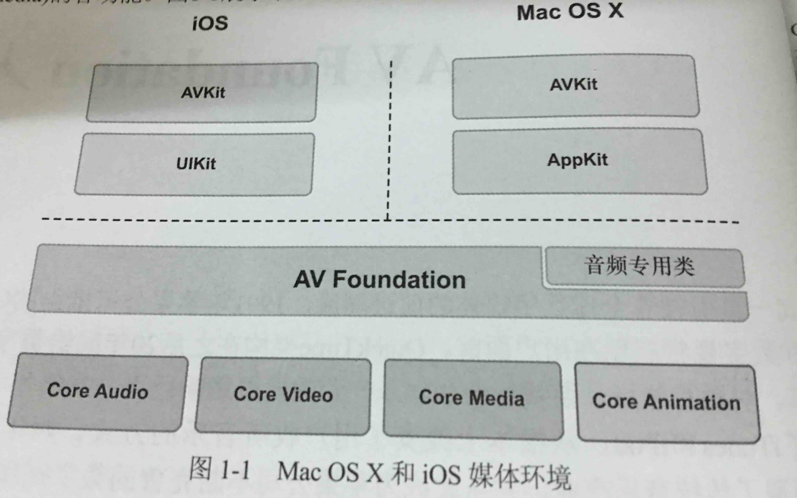

# AV Foundation基础

## AV Foundation基础

### AV Foundation适用范围
- 框架预览
    - 
- 主要框架
- CoreAudio
    - 音频处理框架
    - 扩展学习：《Learning CoreAudio》
- CoreVideo
    - 视频处理的管道模式,逐帧访问
- CoreMedia
    - 提供音频和视频处理的低级数据类型和接口，如CMTime
- CoreAnimation
    - 动画框架
### AV Foundation解析
- 音频播放和记录
	- AVAudioPlayer
	- AVAudioRecorder
- 媒体文件检查
	- 媒体文件的信息，媒体长度，创建时间等
	- 艺术家
- 视频播放
	- AVPlayer
	- AVPlayerItem
- 媒体捕捉
    - 摄像头 AVCaputureSession 
- 媒体编辑
    - 音视频整合，编辑，修改，场景动画，如IMovie
- 媒体处理
    - AVAssetReader
    - AVAssetWriter
### 数字媒体
- 采样只是有模拟信号转换成数字信号的过程
- 媒体的数字采样分两种
    - 时间采样，比如音频的采样，就是对时间的采样，在一个周期内信号的变化。
    - 空间采样，比如视频的采样，对一副图片在一定分辨率下捕捉亮度和色度，然后创建像素点数据并存储为特定格式的视频。 
    - 通常视频即含有时间采样和空间采样。
- 音频采样
    - 麦克风（电动式麦克风）
    - 采样频率（Hz）
    - 人类可接受频率范围（20Hz - 20kHz）
    - 音频数字化的一个编码方法 - `Linear pulse-code modulation`，采样时按照一定的采样率进行的
    - 采样率是指采样的频率，一秒多少次，理论上说采样率越高越好，但是实际情况是采样率越高，采集到的数据越多，所需存储空间越大。
    - 如果要活的较好的效果，可以按照`Nyquist rate`频率才采集，也即是采样对象最高频率的2倍
    - LPCM 也可称为位元深度，比如CD的位元深度为16，可以得到65536个离散级别的数据。
- 视频采样
    - 视频文件是有一帧一帧的图片组成的，视频文件每秒钟可以展现的帧数称为视频的帧率，以FPS表示，常见的有24FPS,25FPS,30FPS等。
    - 视频的原始数据超乎想象的大，所以基本我们见到的都是经过压缩的视频。 
### 数字媒体压缩
- 数字媒体压缩，虽然在质量上有一点的减少，但是相对于带来的好处，这点衰减可以忽略不计。
- 色彩二次抽样
     - YUV （Y亮度通道 + UV色彩通道）
     - 图片的大部分信息都保存在亮度通道中，所以可以对UV通道进行一定程度的压缩。
     - 常见的采样比例是4:4:4、4:2:2、4:2:0
- 编码器/解码器
    - 视频编码器
        - 支持H.264和AppleProRes
        - H.264 对视频进行了空间压缩和时间压缩
        - AppleProRes 是一种有损编码器，但是仍然后很高的编解码质量，主要是一些专业人员使用。并且这是OSX上可用，在iOS上还是H.264为主。
    - 音频编码器
        - AAC 是支持最好的一种格式
        - MP3 只支持解码，不支持编码
- 容器格式
    - 视频的保存格式，容器中会保存一些额外的信息，比如字幕，时间，标题，作者等
    - 常见的有.mov、.m4v、.mpg、.m4a等 
    - 使用AV Foundation所需操作的格式是QuickTime和MPEG-4
    
### 代码示例

- 头文件

```objc
#import "ViewController.h"
#import <AVFoundation/AVFoundation.h>

@interface ViewController ()
/**语音播放对象*/
@property (nonatomic, strong) AVSpeechSynthesizer *synthesizer;
/**语音支持类型数组*/
@property (nonatomic, copy) NSArray *voices;
/// 播放的文字数组
@property (nonatomic, copy) NSArray *speechStrings;
@end
```

- 实现文件


```objc
- (void)viewDidLoad {
    [super viewDidLoad];
    // Do any additional setup after loading the view, typically from a nib.
    //1 创建AVSpeechSynthesizer对象
    _synthesizer = [[AVSpeechSynthesizer alloc] init];
    // 查看支持的语音体系
    NSLog(@"%@",[AVSpeechSynthesisVoice speechVoices]);
    _voices =
    @[
       [AVSpeechSynthesisVoice voiceWithLanguage:@"zh-CN"]
       ];
//    _speechStrings = @[@"hello world",@"你好",@"what is your name",@"怎么样 AV Foundation",@"哈哈哈哈哈"];
    [self read];
    NSLog(@"%@",_speechStrings);
    dispatch_after(dispatch_time(DISPATCH_TIME_NOW, (int64_t)(2 * NSEC_PER_SEC)), dispatch_get_main_queue(), ^{
        [self beginConversation];
    });
}
// 从本地读取文件
- (void)read {
    _speechStrings = [[NSString stringWithContentsOfFile:[[NSBundle mainBundle]pathForResource:@"test" ofType:@"txt"] encoding:NSUTF8StringEncoding error:nil] componentsSeparatedByString:@"\n"];
}

```


