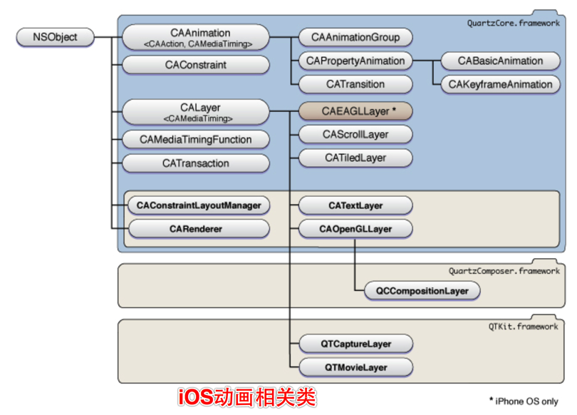
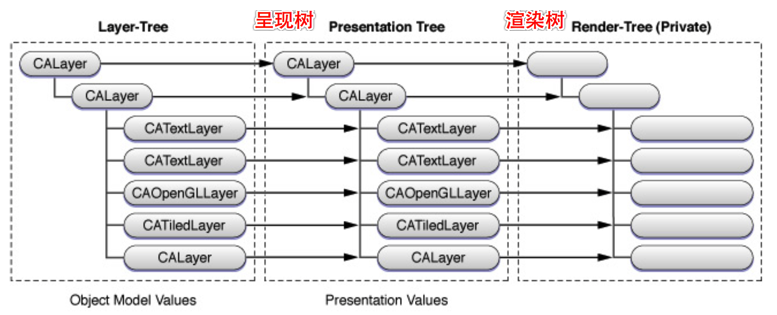
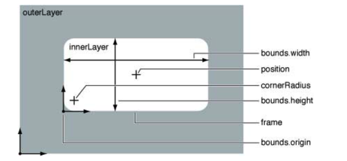

# 核心动画深入理解

## iOS动画相关类

## 图层类
- CALayer 是所有图层类的基础，它使所有核心动画图层类的父类。
- 所有的核心动画的动画类都从`CAAnimation`类继承而来。
	- `CAAnimation` 遵守 `CAMediaTiming`协议，提供动画持续时间，速度，重复计数。
	- `CAAnimation` 遵守 `CAAction` 协议来实现图层动画的响应。
- 具体的`CAAnimation`子类
	- `CATransition` 提供了图层变化的过渡效果，包括淡入淡出`fade`、push、reveal等
	- `CAAnimationGroup` 允许添加一系列动画效果组合起来，并行显示动画。
	- `CAPropertyAnimation` 是支持动画的显示图层的关键路径中指定的属性。
	- `CABasicAnimation` 简单的修改图层属性的动画类
	- `CAKeyframeAnimation` 关键帧动画
- 布局管理类
	- `CAConstraint` 类是一个布局管理器，它可以指定子图层类限制于你指定的约束集合。
- 事务管理类
	- `CATransaction` 是核心动画里面负责协调多个动画原子更新显示操作。事务支持嵌套使用。
	- 事务支持隐式事务和显式事务。

## 核心动画渲染框架
- 图层树
	- 每个可见的图层树由两个相应的树组成:一个是呈现树,一个是渲染树。
	- 
	- 图层树就是用户修改的图层属性值，用户一开始修改属性值，会改变这里的值。
	- 呈现树就是在将要显示时才会修改为最新值。
	- 渲染树在渲染图层的时候使用呈现树的值。渲染树负责执行独立于应用活动的复 杂操作。渲染由一个单独的进程或线程来执行,使其对应用程序的运行循环影响最小。
	- 首先一个核心动画开始执行之前，会首先修改图层树中的属性值，然后将要显示是更新呈现树种的属性值，在渲染过程中使用呈现树中的属性值。
	
## 图层的几何和变换
- 坐标系
	- iOS中坐标系是在左上角，向右和向下为正。
	- Mac OS 中是在左下角，向上和向右为正。

### 图层的几何
- 图层的所有几何属性,包括图层的矩阵变换,都可以隐式 和显式动画。

	- `position` 位置
	- `bounds` 边界
	- `frame` 位置和尺寸
	- `anchorPoint` 从(0,0)到(1,1)，形变属性会绕着这个点运动

### 几何变换

- `CATransform3D` 的数据结构定义一个同质的三维变换(4x4 CGFloat 值的矩阵),用于 图层的旋转,缩放,偏移,歪斜和应用的透视。
- `transform` (作用于所有图层)和 `sublayerTransform`（只会作用于子图层）
- `CATransform3DIdentity` 是单位矩阵,该矩阵没有缩放、旋转、歪斜、透视。把该 矩阵应用到图层上面,会把图层几何属性修改为默认值。
- 
	
