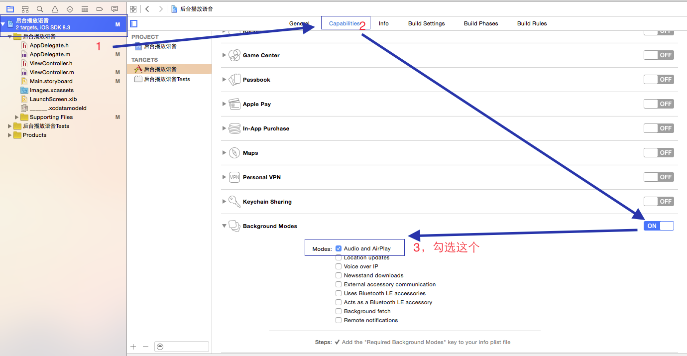

# 后台播放音频

- 使用`AVPlayer`类

## 播放单个音频

- 1、首先要配置应用的后台模式
	- 工程->Targets->Capabilities->Background Modes->ON
	- 然后勾选下面的Audio and AirPlay


- 2、在AppDelegate中设置回调

```
- (BOOL)application:(UIApplication *)application didFinishLaunchingWithOptions:(NSDictionary *)launchOptions {
    // 设置音频回调
    [[AVAudioSession sharedInstance] setCategory:AVAudioSessionCategoryPlayback error:nil];
    // 设置音频流激活状态
    [[AVAudioSession sharedInstance] setActive:YES error:nil];
    
    return YES;
}
```
- 3、设置播放
- 初始化播放对象
	
```
	/** 播放器对象 */
	@property (nonatomic, strong) AVPlayer *player;
	
	self.player = [[AVPlayer alloc] initWithURL:[NSURL URLWithString:@"http://music.baidutt.com/up/kwcacwkw/cmdkwd.mp3"]];
```

- 播放与暂停

```
- (IBAction)pause:(id)sender {
  
    [self.player pause];
}

- (IBAction)playAudio:(id)sender {
    [self.player play];
}
```

## 播放多个音频文件

- 其他操作类似，只是需要在初始化player对象时指定一个资源数组。
- `AVQueuePlayer`用于保存一个播放队列,进入后台模式后会依次播放指定的音频
- 初始化方式

```
/** 初始化播放器 */
- (void)initAudioPlayer {
    NSArray *queue = @[
                       [AVPlayerItem playerItemWithURL:[NSURL URLWithString:@"http://music.baidutt.com/up/kwcacwkw/cmdkwd.mp3"]],
                       [AVPlayerItem playerItemWithURL:[NSURL URLWithString:@"http://music.baidutt.com/up/kwcacwkw/yysdku.mp3"]],
                       [AVPlayerItem playerItemWithURL:[NSURL URLWithString:@"http://music.baidutt.com/up/kwcacwkw/uyuuuy.mp3"]]
                       ];
    self.player = [[AVQueuePlayer alloc] initWithItems:queue];
    
    // 自动跳转到下一个item
    self.player.actionAtItemEnd = AVPlayerActionAtItemEndAdvance;
}
```


