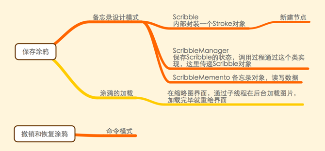

# Objective-C编程之道
- 这本书主要讲的是设计模式，基于`Cocoa Touch`框架下的设计模式。
- 设计模式：为特定场景下的问题而定制的解决方案，以后如果有相同场景，可以直接拿来用。

## 设计模式起源
- MVC模式在`Cocoa Touch`中使用很广泛。这个模式是一个混和设计模式，包含很多其他设计模式在里面。设计应用程序时一定要对一个对象或者类明确其在MVC中的角色。
- `MVC(Model-View-Controller)`中每个角色负责不同的功能。
    - `Model` 主要封装模型对象中的数据和基本行为。
    - `View` 主要向用户展示信息。
    - `Controller` 主要负责View和Model的沟通。

- 所谓`MVC`混合模式
    - 组合 `Composite`
    - 命令 `Command`
    - 中介者 `Mediator`
    - 策略 `Strategy`
    - 观察者 `Observer`
- 设计问题
    - 针对接口编程，而不是实现编程。
    - 协议和抽象基类。
    - 对象组合和类继承。（优先使用组合而不是类继承）
- 以涂鸦来做分析
- 首先使用中介者

