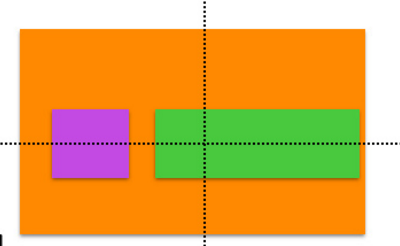
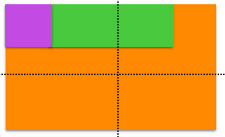
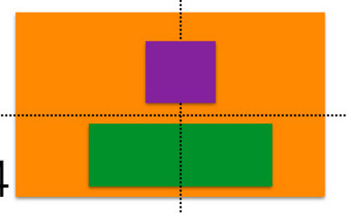
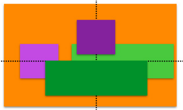
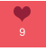
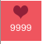

# UIButton

## UIButton做frame动画时，不响应点击
- 在一个View内部加入几个按钮，然后改变这个view的frame来做动画，但是按钮不响应点击事件。

- 问题代码

```
    __block CGRect rect = _scrollView.frame;
    CGFloat width = [UIScreen mainScreen].bounds.size.width;
    [UIView setAnimationsEnabled:YES];
    [UIView animateWithDuration:0.3f animations:^{
        rect.origin.x -= 10;
        if (rect.origin.x <= - width) {
             // 添加下一个scrollView到self
            [UIView setAnimationsEnabled:NO];
            rect.origin.x = width + 10;
            
        }
        _scrollView.frame = rect;
    } completion:^(BOOL finished) {
        
    }];
```

- 解决问题

```
    [UIView animateWithDuration:0.3f delay:0 options:UIViewAnimationOptionAllowUserInteraction animations:^{
        rect.origin.x -= 10;
        if (rect.origin.x <= - width) {
            // 添加下一个scrollView到self
            [UIView setAnimationsEnabled:NO];
            rect.origin.x = width + 10;
        }
        _scrollView.frame = rect;
    } completion:^(BOOL finished) {
        
    }];
```

- 结论
- 应该是在改变一个控件的frame做动画时，控件的交互被关闭了，所以要在做动画时手动开启交互。

# UIButton 内部布局变化

## 竖排


```
- (void)viewDidLoad {
    [super viewDidLoad];
    // Do any additional setup after loading the view, typically from a nib.
    _focusBtn  = [UIButton buttonWithType:UIButtonTypeCustom];
    _focusBtn.frame = CGRectMake(10, 100, 52, 52);
    _focusBtn.backgroundColor = [UIColor greenColor];
//    _focusBtn = [[UIButton alloc] initWithFrame:CGRectMake(70, 70, 52, 52)];
    [_focusBtn setTitle:@"关注" forState:UIControlStateNormal];
    
    CGFloat buttonWidth = 52;
    CGFloat textWidth = 30;
    CGFloat imageWidth = 19;
//    [_focusBtn setImage:[UIImage imageNamed:@"chatpanel_focusBtn"] forState:UIControlStateNormal];
    [_focusBtn setImage:[UIImage imageNamed:@"chatpanel_focusBtn"] forState:UIControlStateNormal];
    [_focusBtn setBackgroundImage:[UIImage imageNamed:@"chatpanel_redcolor"] forState:UIControlStateNormal];
    [_focusBtn setContentHorizontalAlignment:UIControlContentHorizontalAlignmentLeft];
    [_focusBtn setContentVerticalAlignment:UIControlContentVerticalAlignmentTop];
    
    [_focusBtn setImageEdgeInsets:UIEdgeInsetsMake(6,(52-20)/2, 0, _focusBtn.titleLabel.bounds.size.width )];
    [_focusBtn setTitleEdgeInsets:UIEdgeInsetsMake(17.5 + 6 , - ([_focusBtn currentImage].size.width)  + 7 , 9,0 )];
   
    
    [self.view addSubview:_focusBtn];

    
}
```

## UIButton 默认布局
- 默认布局是横排：图片在左，label在右，并且居中方式是水平居中对齐，垂直居中对齐。
    - 
    - 紫色是image的frame，绿色是label的frame，黄色是button的frame
- 如果要改变为竖排，那么首先要把对齐方式改为水平靠左，垂直靠上。
    -     
    - 然后再设置每个子控件的`UIEdgeInsets`
    - 最终展示效果是这样的
    - 
    - 中间过渡过程是这样的
    - 
    - 由此图可见，image要的left要右移，也就是增大正数，但是label的left要左移，也就是要减小为负数。
    - 这里总结一下，`UIEdgeInsets`的top，left，bottom，right属性，分别表示处于父控件的内部边距，如left，为正数，表示右移多少，为负数，表示左移多少。
``` objc
    [_focusBtn setContentHorizontalAlignment:UIControlContentHorizontalAlignmentLeft];
    [_focusBtn setContentVerticalAlignment:UIControlContentVerticalAlignmentTop];
```
    
- 注：在iOS中，UIEdgeInsets跟web中的padding一样的分top，left，bottom和right，正数就表示与周围的距离变大，例如：默认在是0，我把top变成了10，这时该元素与顶端的距离就会增加10，即元素下移，距离变大。如果是负数的话效果就相反了，距离拉近。

```objc
     [_focusBtn setImageEdgeInsets:UIEdgeInsetsMake(6,(52-20)/2, 0, _focusBtn.titleLabel.bounds.size.width )];
    [_focusBtn setTitleEdgeInsets:UIEdgeInsetsMake(17.5 + 6 , - ([_focusBtn currentImage].size.width)  + 7 , 9,0 )];
```
- 这样的效果就是
- 

## label居中问题
- 下午计算文字的宽度的时候一直出问题，主要是根据文字宽度计算内边距，但是文字长度不等，对这个布局有很大影响。
- 
- 
- 

```objc
- (void)focusedBtn:(NSInteger)number
{
    _focusedBtn = [[UIButton alloc] initWithFrame:CGRectMake(0, 100, 52, 52)];
    NSString *title = @"";
    if (number >= 10000)
    {
        title = [NSString stringWithFormat:@"%.1f万",number/10000.0];
    }
    else
    {
        title = [NSString stringWithFormat:@"%zd",number];

    }
        
    [_focusedBtn setTitle:title forState:UIControlStateNormal];
    
    UILabel *lab = [[UILabel alloc] init];
    lab.text = @"1";
    lab.font = [UIFont systemFontOfSize:12]; // font 12 ： label.width 7
    [lab sizeToFit];
    NSLog(@"%@",NSStringFromCGSize(lab.bounds.size));
    
    NSLog(@"buttuon:%@",NSStringFromCGRect(_focusedBtn.frame));
    NSLog(@"imageView:%@",NSStringFromCGRect(_focusedBtn.imageView.frame));
    NSLog(@"textLabel:%@",NSStringFromCGRect(_focusedBtn.titleLabel.frame));
    NSLog(@"---------------------");

    CGFloat buttonWidth = 52;
    CGFloat textWidth = 40;
    CGFloat imageWidth = 19;
    CGFloat imageHeight = 19;
    [_focusedBtn setImage:[UIImage imageNamed:@"chatpanel_focusBtn"] forState:UIControlStateNormal]; // 关注后这个图片改变了
    [_focusedBtn setBackgroundImage:[UIImage imageNamed:@"chatpanel_redcolor"] forState:UIControlStateNormal];
    [_focusedBtn setContentHorizontalAlignment:UIControlContentHorizontalAlignmentLeft];
    [_focusedBtn setContentVerticalAlignment:UIControlContentVerticalAlignmentTop];
    
    [_focusedBtn setImageEdgeInsets:UIEdgeInsetsMake(6,(buttonWidth-imageWidth)/2, 0, 0 )];
  
    [_focusedBtn.titleLabel setFont:[UIFont systemFontOfSize:12.0f]];
    [_focusedBtn.titleLabel setContentMode:UIViewContentModeCenter];
    _focusedBtn.titleLabel.textAlignment = NSTextAlignmentCenter;
    [_focusedBtn.titleLabel sizeToFit];
    // 我尝试在label宽度基础上加上一个字符宽度。只要字符不超过一定长度，显示就没有问题
    [_focusedBtn setTitleEdgeInsets:UIEdgeInsetsMake(imageHeight + 10 ,- _focusedBtn.titleLabel.bounds.size.width/2 + 7, 9,0)];
    
    
    NSLog(@"buttuon:%@",NSStringFromCGRect(_focusedBtn.frame));
    NSLog(@"imageView:%@",NSStringFromCGRect(_focusedBtn.imageView.frame));
    NSLog(@"textLabel:%@",NSStringFromCGRect(_focusedBtn.titleLabel.frame));
    
    [self.view addSubview:_focusedBtn];
}
```